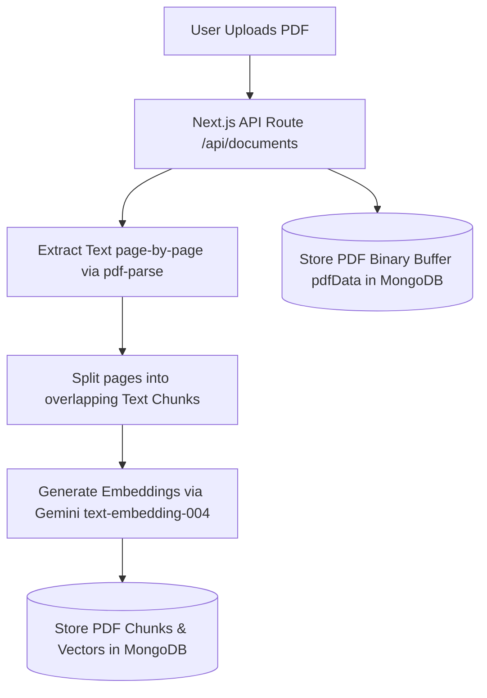
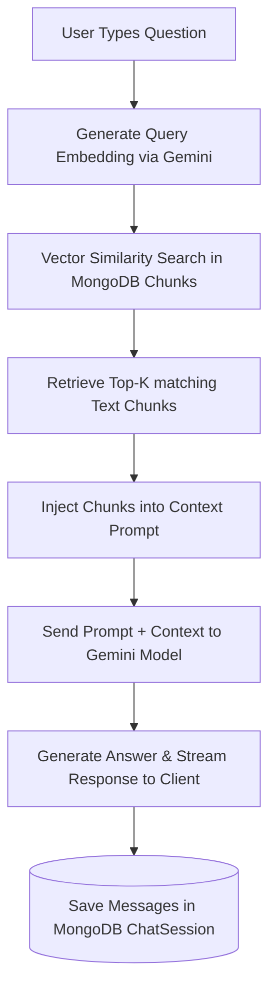
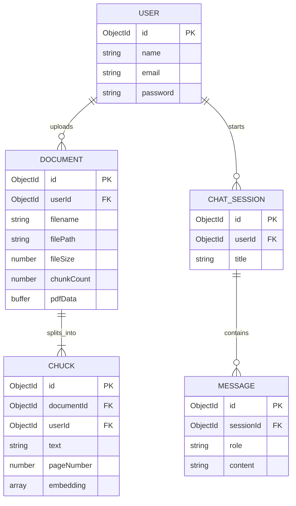

# PDF Chat AI

An intelligent AI-powered document assistant that enables users to upload PDF documents and have natural, context-aware conversations about their contents. The project features a full RAG (Retrieval-Augmented Generation) pipeline using Next.js, MongoDB Atlas, and the Google Gemini API.

---

## 🏗️ Architecture & Data Flow

This application is built around a RAG (Retrieval-Augmented Generation) pipeline. The architecture consists of two main workflows: **Document Indexing** and **Semantic Chat Querying**.

### 1. Document Indexing & Storage Flow (Upload)


### 2. Semantic Chat & Context Retrieval Flow (Query)


---

## 🗄️ Database Relationships (ERD)

The database schema manages user accounts, sessions, conversations, documents, and vector embeddings in MongoDB.



---

## 📂 Project File Structure

Here is the structural organization of the codebase:

```text
pdf-chat-ai/
├── public/                 # Static assets (icons, SVGs)
├── scratch/                # Diagnostic scripts and test tools
│   └── test_rag.mjs        # Local DB & Gemini API connectivity checks
├── src/
│   ├── app/                # Next.js App Router (Pages & API endpoints)
│   │   ├── api/            # Serverless API routes
│   │   │   ├── auth/       # Authentication (login, logout, signup, session checking)
│   │   │   ├── chat/       # Conversation sessions & query routing
│   │   │   ├── documents/  # PDF uploads, parsing, and vector indexing
│   │   │   ├── setup-check/# Live diagnostic connection checks
│   │   │   └── uploads/    # Secure database-backed PDF server route
│   │   ├── chat/           # Chat session interfaces
│   │   ├── dashboard/      # Main application dashboard
│   │   ├── login/          # User authentication login portal
│   │   ├── signup/         # User signup page
│   │   ├── globals.css     # CSS Global configurations (TailwindCSS v4)
│   │   ├── layout.js       # App layout wrapper
│   │   ├── middleware.js   # JWT-based Route protection and redirection
│   │   └── page.js         # Landing welcome page
│   ├── components/         # Reusable React components (Navbar, DocumentUpload, etc.)
│   ├── lib/                # Shared utilities and configurations
│   │   ├── auth.js         # JWT signing, verification, and cookie helpers
│   │   ├── db.js           # Mongoose cached connection utility
│   │   ├── gemini.js       # Google Gemini API embeddings client wrapper
│   │   └── pdf.js          # Local PDF text extraction and chunking utilities
│   └── models/             # Mongoose database schemas
│       ├── ChatSession.js  # Conversational history sessions
│       ├── Chunk.js        # Vector-stored document text fragments
│       ├── Document.js     # Uploaded PDF document file metadata and binary buffers
│       ├── Message.js      # Individual conversation history entries
│       └── User.js         # Registered user accounts
├── .env.local              # Local configuration secrets (Git-ignored)
├── .gitignore              # Files and patterns excluded from version control
├── next.config.mjs         # Next.js bundler and route settings
├── package.json            # Scripts, dependencies, and manifest file
└── jsconfig.json           # Absolute path resolving configurations (@/*)
```

---

## 🛠️ Getting Started & Setup

### 1. Prerequisites
- **Node.js** (v18 or higher recommended)
- **MongoDB Atlas** account (or local MongoDB database instance)
- **Google AI Studio API Key** (for Gemini embeddings and chat models)

### 2. Environment Configuration
Create a `.env.local` file in the root directory and configure the following variables:

```env
MONGODB_URI=your_mongodb_connection_string
JWT_SECRET=any_secure_random_string_at_least_32_chars
GEMINI_API_KEY=your_gemini_api_key_from_google_ai_studio
```

### 3. Installation
Install project dependencies:
```bash
npm install
```

### 4. Running Diagnostics
Before starting the development server, you can run a diagnostic script to check your database connection and Gemini API authentication status:
```bash
node scratch/test_rag.mjs
```

### 5. Running Locally
Start the development server:
```bash
npm run dev
```
Open [http://localhost:3000](http://localhost:3000) in your browser to view the application.

---

## 🚀 Production Deployment

This project is configured to run out-of-the-box on **Vercel** with zero local disk requirements (using MongoDB Atlas for PDF binary storage):

1. Link and deploy your project on Vercel:
   ```bash
   vercel
   ```
2. Configure environment variables (`MONGODB_URI`, `JWT_SECRET`, and `GEMINI_API_KEY`) inside your **Vercel Project Dashboard**.
3. Deploy to production:
   ```bash
   vercel --prod
   ```
